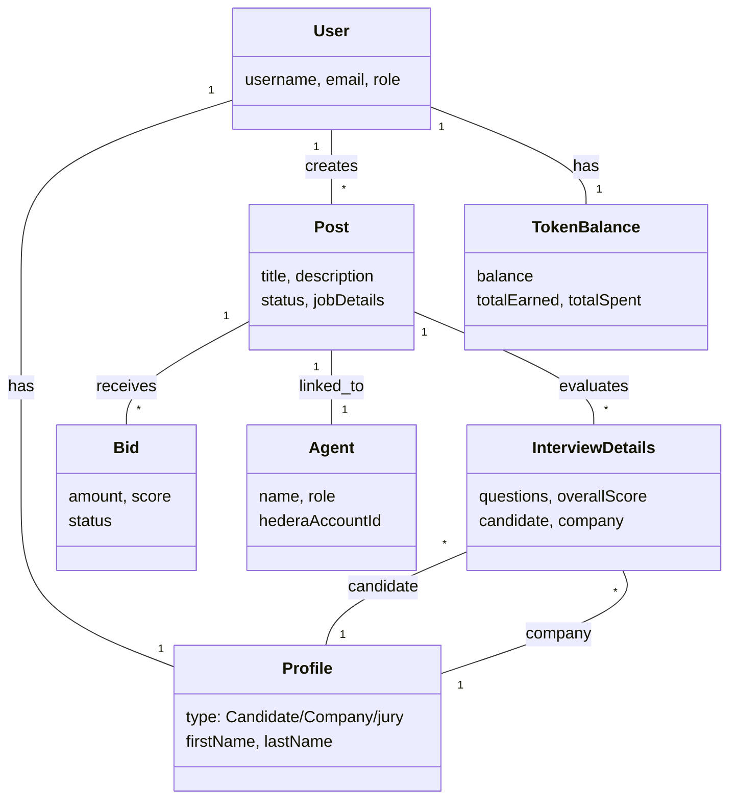

# Diagramme de Classe - TalentAI Platform

## Vue d'ensemble de l'architecture

Ce diagramme UML représente l'architecture complète du système TalentAI, incluant les entités principales, leurs relations et les flux de données.

```mermaid
classDiagram
    %% ==================== UTILISATEURS ET PROFILS ====================
    class User {
        -_id: ObjectId
        -username: String
        -email: String
        -otp: Object
        -isVerified: Boolean
        -isBanned: Boolean
        -isHaker: Boolean
        -warnings: Number
        -lastLogin: Date
        -ip: String
        -Localisation: String
        -role: enum[Company, jury, Candidat, Admin]
        -profile: ObjectId ref Profile
        -post: Array ObjectId ref Post
        -trafficCounter: Number
        -authHistory: Array
        -hederaAccountId: String
        -hederaPrivateKey: String
        -hederaPublicKey: String
        -gasFeeBalance: Number
    }

    class Profile {
        -_id: ObjectId
        -userId: ObjectId ref User
        -type: enum[Candidate, Company, jury]
        -user_image: String
        -firstName: String
        -lastName: String
        -age: String
        -gender: enum[Male, Female, Other]
        -educationLevel: String
        -country: String
        -language: String
        -timeZone: String
        -expectedSalary: Object
        -skills: Array
        -certifications: Array
        -resume: ObjectId ref Resume
        -todoList: ObjectId ref TodoList
        -usersBidedByCompany: Array ObjectId ref User
    }

    class TodoList {
        -_id: ObjectId
        -profile: ObjectId ref Profile
        -todos: Array Todo
        -createdAt: Date
        -updatedAt: Date
    }

    class Todo {
        -type: enum[Profile, Skill]
        -title: String
        -isCompleted: Boolean
        -tasks: Array Task
    }

    class Task {
        -title: String
        -type: enum[Course, Certification, Project, Article]
        -description: String
        -url: String
        -priority: enum[low, medium, high]
        -isCompleted: Boolean
        -dueDate: Number
    }

    class Resume {
        -_id: ObjectId
        -userId: ObjectId ref User
        -sections: Array Section
        -createdAt: Date
        -updatedAt: Date
    }

    class Section {
        -id: String
        -type: String
        -x: Number
        -y: Number
        -width: Number
        -height: Number
        -name: String
        -jobTitle: String
        -content: String
        -title: String
        -company: String
        -skills: Array
        -raw: Mixed
    }

    %% ==================== EMPLOIS ET BIDDING ====================
    class Post {
        -_id: ObjectId
        -jobDetails: JobDetails
        -skillAnalysis: SkillAnalysis
        -linkedinPost: LinkedinPost
        -availableFrom: Number
        -availableUntil: Number
        -status: enum[DRAFT, POSTED, SCHEDULED]
        -createdAt: Date
        -user: ObjectId ref User
        -agentId: ObjectId ref Agent
        -agentConfig: ObjectId ref AgentConfig
        -post_Steps: Array ObjectId ref Post_Steps
    }

    class JobDetails {
        -title: String
        -description: String
        -requirements: Array String
        -responsibilities: Array String
        -location: String
        -employmentType: String
        -experienceLevel: String
        -salary: Salary
    }

    class Salary {
        -min: Number
        -max: Number
        -currency: String
    }

    class SkillAnalysis {
        -requiredSkills: Array Skill
        -suggestedSkills: SuggestedSkills
        -skillSummary: SkillSummary
    }

    class Skill {
        -name: String
        -level: String
        -importance: String
        -category: String
        -percentage: Number
    }

    class SuggestedSkills {
        -technical: Array SuggestedSkill
        -frameworks: Array SuggestedSkill
        -tools: Array SuggestedSkill
    }

    class SuggestedSkill {
        -name: String
        -reason: String
        -category: String
        -priority: String
        -relatedTo: String
        -purpose: String
    }

    class SkillSummary {
        -mainTechnologies: Array String
        -complementarySkills: Array String
        -learningPath: Array String
        -stackComplexity: String
    }

    class LinkedinPost {
        -formattedContent: FormattedContent
        -hashtags: Array String
        -formatting: Formatting
        -finalPost: String
    }

    class FormattedContent {
        -headline: String
        -introduction: String
        -companyPitch: String
        -roleOverview: String
        -keyPoints: Array String
        -skillsRequired: String
        -benefitsSection: String
        -callToAction: String
    }

    class Formatting {
        -emojis: EmojiFormatting
    }

    class EmojiFormatting {
        -company: String
        -location: String
        -salary: String
        -requirements: String
        -skills: String
        -benefits: String
        -apply: String
    }

    class Bid {
        -_id: ObjectId
        -postId: String
        -bidderId: ObjectId ref User
        -bidderAccount: String
        -amount: Number
        -score: Number
        -status: enum[pending, active, refunded, won]
        -createdAt: Date
        -updatedAt: Date
    }

    %% ==================== ENTRETIENS ET EVALUATIONS ====================
    class InterviewDetails {
        -_id: ObjectId
        -candidate: ObjectId ref Profile
        -company: ObjectId ref Profile
        -post: ObjectId ref Post
        -jobAssessmentResult: ObjectId ref JobAssessmentResult
        -type: enum[INITIAL, TECHNICAL, HR, FINAL]
        -interviewContext: InterviewContext
        -questions: Array QuestionAnswer
        -overallScore: Number
        -skillDetails: Array SkillDetails
        -recommendations: Array String
        -createdAt: Number
    }

    class InterviewContext {
        -targetCompany: String
        -companyIndustry: String
        -companyCulture: String
        -targetRole: String
        -experienceLevel: String
        -interviewFormat: String
        -simulationGoal: String
    }

    class QuestionAnswer {
        -question: String
        -answer: String
        -status: enum[correct, incorrect, partial]
        -exampleCorrectAnswer: String
        -partialCorrectPercentage: Number
        -partialCorrectReason: String
    }

    class SkillDetails {
        -name: String
        -type: enum[TECHNICAL, SOFT, LANGUAGE]
        -requiredLevel: Number
        -proficiencyLevel: Number
        -experienceLevel: String
        -confidenceScore: Number
        -questionAnswerList: Array QuestionAnswer
    }

    class JobAssessmentResult {
        -_id: ObjectId
        -condidateId: ObjectId ref Profile
        -companyId: ObjectId ref Profile
        -jobId: ObjectId ref Post
        -timestamp: Date
        -assessmentType: String
        -numberOfQuestions: Number
        -interviewId: ObjectId ref InterviewDetails
        -analysis: Analysis
    }

    class Analysis {
        -overallScore: Number
        -skillAnalysis: Array SkillAnalysis
        -generalAssessment: String
        -recommendations: Array String
        -technicalLevel: String
        -nextSteps: Array String
        -jobMatch: JobMatch
        -skillProgression: Array SkillProgression
    }

    class SkillAnalysis_Eval {
        -skillName: String
        -requiredLevel: Number
        -demonstratedExperienceLevel: Number
        -strengths: Array String
        -weaknesses: Array String
        -confidenceScore: Number
        -match: String
        -levelGap: Number
    }

    class JobMatch {
        -percentage: Number
        -status: String
        -keyGaps: Array String
    }

    class SkillProgression {
        -skillName: String
        -requiredLevel: Number
        -demonstratedExperienceLevel: Number
        -strengths: Array String
        -weaknesses: Array String
        -confidenceScore: Number
        -match: String
        -levelGap: Number
        -requiredSkill: Object
        -masteryCategory: String
    }

    class EvaluationTopic {
        -_id: ObjectId
        -topicId: String
        -company: String
        -postId: String
        -candidateName: String
        -candidateId: String
        -topicMemo: String
        -status: enum[active, completed, cancelled]
        -createdBy: String
        -createdAt: Date
        -evaluations: Array Evaluation
        -finalResult: FinalResult
    }

    class Evaluation {
        -agentId: ObjectId ref Agent
        -agentName: String
        -agentRole: String
        -messageId: String
        -evaluation: EvalResult
        -timestamp: Date
    }

    class EvalResult {
        -passed: Boolean
        -score: Number
        -feedback: String
        -interviewNotes: String
    }

    class FinalResult {
        -overallScore: Number
        -recommendation: String
        -completedAt: Date
    }

    %% ==================== AGENTS ET CONFIGURATION ====================
    class Agent {
        -_id: ObjectId
        -name: String
        -avatarName: String
        -role: String
        -description: String
        -isActive: Boolean
        -hederaAccountId: String
        -hederaPrivateKey: String
        -hederaPublicKey: String
        -hcs11Profile: Mixed
        -inboundTopicId: String
        -outboundTopicId: String
        -profileRegistrationId: String
        -profileId: String
        -deploymentMessageId: String
        -Company: ObjectId ref User
        -postId: ObjectId ref Post
        -agentConfig: ObjectId ref AgentConfig
        -createdAt: Date
    }

    class AgentConfig {
        -_id: ObjectId
        -agentId: ObjectId ref Agent
        -postId: ObjectId ref Post
        -thresholdPercent: Number
        -bidBudgetMin: Number
        -bidBudgetMax: Number
        -bidStep: Number
        -maxCandidatesToBid: Number
        -agentLifetimeDays: Number
        -bidLifetimeDays: Number
        -autoSubmitTopMatch: Boolean
        -maxDailySpending: Number
        -isActive: Boolean
        -createdAt: Date
        -updatedAt: Date
    }

    %% ==================== POST STEPS ====================
    class Post_Steps {
        -_id: ObjectId
        -id: String
        -order: Number
        -type: String
        -postId: ObjectId ref Post
        -position: Position
        -positionAbsolute: Position
        -width: Number
        -height: Number
        -selected: Boolean
        -dragging: Boolean
        -condition: String
        -status: enum[pending, inProgress, done]
        -data: StepData
        -connections: Array Connection
        -createdAt: Date
        -updatedAt: Date
    }

    class Position {
        -x: Number
        -y: Number
    }

    class StepData {
        -label: String
        -type: String
        -subtitle: String
        -config: StepConfig
    }

    class StepConfig {
        -nodeNumber: Number
        -title: String
        -configured: Boolean
        -lastPrompt: String
        -generatedContent: String
    }

    class Connection {
        -id: String
        -source: String
        -target: String
        -type: String
    }

    class CandidatePostStepProgress {
        -_id: ObjectId
        -idCandidate: ObjectId ref User
        -idPost: ObjectId ref Post
        -currentStep: ObjectId ref Post_Steps
        -steps: Array StepProgress
        -createdAt: Date
        -updatedAt: Date
    }

    class StepProgress {
        -stepId: ObjectId ref Post_Steps
        -interviewDetails: ObjectId ref InterviewDetails
        -status: enum[pending, inProgress, done]
        -completedAt: Date
    }

    %% ==================== TOKENS ET TRANSACTIONS ====================
    class TokenBalance {
        -_id: ObjectId
        -userId: ObjectId ref User
        -balance: Number
        -totalEarned: Number
        -totalSpent: Number
        -lastUpdated: Date
        -createdAt: Date
        -updatedAt: Date
    }

    class TokenTransaction {
        -_id: ObjectId
        -userId: ObjectId ref User
        -transactionId: String
        -type: enum[purchase, spend, refund, bonus, adjustment]
        -amount: Number
        -price: Number
        -status: enum[pending, completed, failed, cancelled]
        -paymentMethod: enum[hedera, hashpack, admin]
        -walletAddress: String
        -hederaTransactionHash: String
        -description: String
        -metadata: Mixed
        -completedAt: Date
        -failureReason: String
        -originalTransactionId: String
        -createdAt: Date
        -updatedAt: Date
    }

    %% ==================== AUTRES ENTITES ====================
    class Topic {
        -_id: ObjectId
        -postId: String
        -topicId: String
        -status: enum[active, closed]
        -createdAt: Date
        -closedAt: Date
    }

    class Notification {
        -_id: ObjectId
        -content: String
        -type: enum[info, success, warning, error, custom]
        -url: String
        -read: Boolean
        -recipient: ObjectId ref User
        -createdAt: Date
    }

    class Feedback {
        -_id: ObjectId
        -userId: ObjectId ref User
        -feedback: Array String
        -comment: String
        -createdAt: Date
    }

    class Log {
        -_id: ObjectId
        -type: String
        -method: String
        -url: String
        -ip: String
        -referer: String
        -statusCode: Number
        -user_id: String
        -user_nom: String
        -headers: String
        -executionTime: Number
        -location: String
        -body: String
        -timestamp: Date
    }

    %% ==================== RELATIONS ====================
    
    %% User Relations
    User "1" -- "0..1" Profile : has
    User "1" -- "0..*" Post : creates
    User "1" -- "0..1" TokenBalance : manages
    User "1" -- "0..*" TokenTransaction : performs
    User "1" -- "0..*" Notification : receives
    User "1" -- "0..*" Feedback : provides
    
    %% Profile Relations
    Profile "1" -- "0..1" TodoList : has
    Profile "1" -- "0..1" Resume : manages
    Profile "1" -- "0..*" InterviewDetails : candidate
    Profile "1" -- "0..*" JobAssessmentResult : candidate_or_company
    
    %% TodoList Relations
    TodoList "1" -- "0..*" Todo : contains
    Todo "1" -- "0..*" Task : contains
    
    %% Resume Relations
    Resume "1" -- "0..*" Section : contains
    
    %% Post Relations
    Post "1" -- "0..1" Agent : linked_to
    Post "1" -- "0..1" AgentConfig : configured_by
    Post "1" -- "0..*" Bid : receives
    Post "1" -- "0..*" Post_Steps : has
    Post "1" -- "0..*" CandidatePostStepProgress : tracks
    Post "1" -- "0..*" InterviewDetails : reference
    Post "1" -- "0..*" JobAssessmentResult : reference
    Post "1" -- "0..1" Topic : creates
    
    %% Post Details Relations
    Post "1" -- "1" JobDetails : contains
    Post "1" -- "1" SkillAnalysis : contains
    Post "1" -- "1" LinkedinPost : contains
    JobDetails "1" -- "1" Salary : has
    SkillAnalysis "1" -- "0..*" Skill : requires
    SkillAnalysis "1" -- "1" SuggestedSkills : suggests
    SuggestedSkills "1" -- "0..*" SuggestedSkill : technical
    SuggestedSkills "1" -- "0..*" SuggestedSkill : frameworks
    SuggestedSkills "1" -- "0..*" SuggestedSkill : tools
    LinkedinPost "1" -- "1" FormattedContent : contains
    LinkedinPost "1" -- "1" Formatting : has
    Formatting "1" -- "1" EmojiFormatting : uses
    
    %% Bid Relations
    Bid "0..*" -- "1" Post : places_on
    Bid "0..*" -- "1" User : placed_by
    
    %% Interview Relations
    InterviewDetails "1" -- "1" InterviewContext : has
    InterviewDetails "0..*" -- "1" Post : reference
    InterviewDetails "0..*" -- "1" Profile : candidate
    InterviewDetails "0..*" -- "1" Profile : company
    InterviewDetails "0..*" -- "1" JobAssessmentResult : generates
    InterviewDetails "1" -- "0..*" QuestionAnswer : contains
    InterviewDetails "1" -- "0..*" SkillDetails : analyzes
    SkillDetails "1" -- "0..*" QuestionAnswer : contains
    
    %% Assessment Relations
    JobAssessmentResult "1" -- "0..1" Analysis : contains
    Analysis "1" -- "0..*" SkillAnalysis_Eval : analyzes
    Analysis "1" -- "1" JobMatch : has
    Analysis "1" -- "0..*" SkillProgression : tracks
    
    %% Evaluation Relations
    EvaluationTopic "1" -- "0..*" Evaluation : contains
    EvaluationTopic "1" -- "1" FinalResult : has
    Evaluation "1" -- "1" EvalResult : contains
    
    %% Agent Relations
    Agent "1" -- "0..1" AgentConfig : configured_with
    Agent "0..1" -- "1" Post : linked_to
    Agent "0..1" -- "1" User : owned_by
    
    %% Post Steps Relations
    Post "1" -- "0..*" Post_Steps : contains
    Post_Steps "1" -- "1" Position : position
    Post_Steps "1" -- "1" StepData : contains
    StepData "1" -- "1" StepConfig : has
    Post_Steps "0..*" -- "0..*" Connection : has
    Post_Steps "1" -- "0..*" CandidatePostStepProgress : tracked_by
    
    %% Candidate Progress Relations
    CandidatePostStepProgress "0..*" -- "1" User : candidate
    CandidatePostStepProgress "0..*" -- "1" Post : post
    CandidatePostStepProgress "1" -- "0..*" StepProgress : contains
    StepProgress "1" -- "0..1" InterviewDetails : interview
    
    %% Token Relations
    TokenBalance "1" -- "0..*" TokenTransaction : tracks
    
    %% Notification Relations
    Notification "0..*" -- "1" User : sent_to
```

    ## Diagramme mis à jour — Infrastructure & Services

    Ajouts importants : classes d'infrastructure et services temps réel/planification

    ```mermaid
    classDiagram
        class API {
            +expressApp
            +routes
        }

        class SocketIO {
            -path: '/socket.io/'
            -transports: websocket,polling
            -pingInterval
        }

        class AgendaService {
            -jobs
            -schedule()
        }

        class CronJob {
            -name
            -schedule
        }

        class Redis {
            -url
        }

        class StripeService {
            -webhookHandler()
        }

        class HederaService {
            -hederaClient
        }

        class ChatbotMicroservice {
            -model
        }

        class NotificationService {
            -createSystemNotification()
            -broadcastSystemNotification()
        }

        %% Relations infra
        API <-- SocketIO : integrates
        API --> AgendaService : schedules
        API --> CronJob : triggers
        API -->|calls| NotificationService
        API -->|calls| StripeService
        API -->|calls| HederaService
        API -->|calls| ChatbotMicroservice
        SocketIO <-- Redis : adapter
        AgendaService --> Redis : optional_lock
        CronJob --> Redis : leader_election
        NotificationService --> SocketIO : publish
        ChatbotMicroservice -->|async| API
    ```

## Vue simplifiée : Entités principales



## Flux mis à jour — inclusions infra

### Notifications en temps réel
```
API -> NotificationService -> SocketIO -> Client (room by userId)
```

### Tâches planifiées
```
AgendaService/CronJob -> Services (resetQuota, DailyExchangeRateUpdate) -> MongoDB
```

## Remarques opérationnelles ajoutées
- Socket.IO utilise le path `/socket.io/`; recommander d'ajouter `REDIS_URL` et adapter `socket.io-redis` pour multi-instance.
- Agenda/cron doivent être exécutés de manière exclusive (leader election via Redis conseillé).
- Stripe et Hedera sont des services externes critiques — surveiller webhooks et retry logic.

---

Diagramme mis à jour. Indiquez si vous voulez :
- un diagramme d'interaction (sequence) pour le flow d'entretien,
- ou un export PNG/SVG du mermaid.

## Flux de données principaux

### 1. Processus d'Embauche
```
User (Company) → Post → Agent (bidding) → Bid → Candidate → Interview → Assessment
```

### 2. Gestion des Tokens
```
User → TokenTransaction (purchase) → TokenBalance → TokenTransaction (spend)
```

### 3. Évaluation des Candidats
```
InterviewDetails → QuestionAnswer → SkillDetails → JobAssessmentResult → Analysis
```

### 4. Progression des Candidats
```
Post → Post_Steps → CandidatePostStepProgress → InterviewDetails → Evaluation
```

## Relations clés

| Relation | Type | Description |
|----------|------|-------------|
| User → Profile | 1:1 | Un utilisateur a un profil |
| User → Post | 1:* | Un utilisateur crée plusieurs posts |
| Post → Agent | 1:1 | Un post est lié à un agent (bidding automatique) |
| Post → Post_Steps | 1:* | Un post contient plusieurs étapes |
| Post → Bid | 1:* | Un post reçoit plusieurs bids |
| Agent → AgentConfig | 1:1 | Un agent a une configuration |
| InterviewDetails → JobAssessmentResult | 1:1 | Une entrevue génère une évaluation |
| Profile → TodoList | 1:1 | Un profil a une liste de tâches |
| User → TokenTransaction | 1:* | Un utilisateur effectue plusieurs transactions |

## Entités Importantes par Domaine

### 📊 Recrutement
- `User`, `Profile`, `Post`, `Agent`, `AgentConfig`, `Bid`

### 🎯 Entrevues & Évaluations  
- `InterviewDetails`, `JobAssessmentResult`, `EvaluationTopic`, `Post_Steps`, `CandidatePostStepProgress`

### 💰 Système Monétaire
- `TokenBalance`, `TokenTransaction`, `User.gasFeeBalance`

### 🔔 Communication
- `Notification`, `EvaluationTopic`, `Topic`

### 📋 Données Utilisateur
- `Profile`, `Resume`, `TodoList`, `Feedback`

### ⛓️ Blockchain Integration (Hedera)
- `User.hederaAccountId`, `Agent.hcs11Profile`, `Topic.topicId`, `TokenTransaction.hederaTransactionHash`

