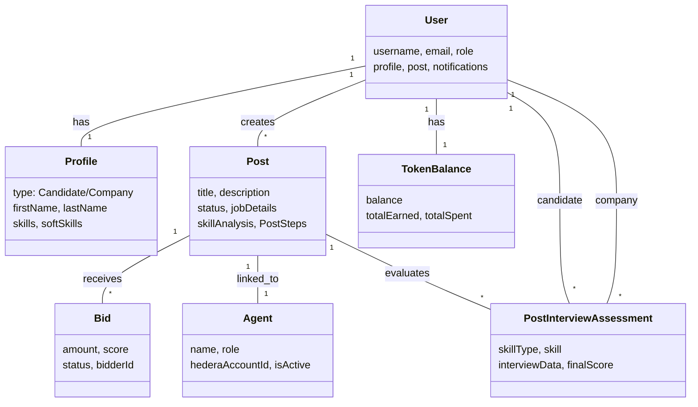

# Diagramme de Classe - TalentAI Platform

## Vue d'ensemble de l'architecture (MISE À JOUR)

Ce diagramme UML représente l'architecture complète du système TalentAI, synchronisé avec les modèles réels du système.

```mermaid
classDiagram
    %% ==================== UTILISATEURS ET PROFILS ====================
    class User {
        -_id: ObjectId
        -username: String
        -email: String
        -otp: {code: String, expiresAt: Date}
        -isVerified: Boolean
        -isBanned: Boolean
        -isHaker: Boolean
        -warnings: Number
        -lastLogin: Date
        -ip: String
        -Localisation: String
        -role: enum["Company", "Candidate", "Admin"]
        -profile: ObjectId ref Profile
        -post: Array ObjectId ref Post
        -trafficCounter: Number
        -authHistory: Array
        -hederaAccountId: String
        -hederaPrivateKey: String
        -hederaPublicKey: String
        -gasFeeBalance: Number
        -notifications: Array ObjectId ref Notification
        -companyMembership: ObjectId ref CompanyMembership
        +timestamps
    }

    class Profile {
        -_id: ObjectId
        -userId: ObjectId ref User
        -type: enum["Candidate", "Company"]
        -user_image: String
        -firstName: String
        -lastName: String
        -age: String
        -gender: enum["Male", "Female", "Other", "Prefer not to say"]
        -educationLevel: String
        -country: String
        -language: String
        -timeZone: String
        -contactInformation: Object
        -preferredContractType: String
        -workModePreference: String
        -expectedSalary: {min: Number, max: Number, currency: String}
        -skills: Array skillSchema
        -softSkills: Array softSkillSchema
        -quota: Number
        -quotaUpdatedAt: Date
        -readyForMatch: Boolean
        -isPublicProfile: Boolean
        -todoList: ObjectId ref TodoList
        -interviewDetails: Array ObjectId ref SkillInterviewAssessment
        -companyDetails: Object
        -requiredSkills: Array String
        -requiredExperienceLevel: enum["Entry Level", "Junior", "Mid Level", "Senior", "Expert"]
        -targetRole: String
        -companyBid: Object
        -usersBidedByCompany: Array ObjectId ref User
        +timestamps
    }

    class TodoList {
        -_id: ObjectId
        -profile: ObjectId ref Profile
        -todos: Array Todo
        -createdAt: Date
        -updatedAt: Date
    }

    class Todo {
        -type: enum[Profile, Skill]
        -title: String
        -isCompleted: Boolean
        -tasks: Array Task
    }

    class Task {
        -title: String
        -type: enum[Course, Certification, Project, Article]
        -description: String
        -url: String
        -priority: enum[low, medium, high]
        -isCompleted: Boolean
        -dueDate: Number
    }

    class Resume {
        -_id: ObjectId
        -userId: ObjectId ref User
        -sections: Array Section
        -createdAt: Date
        -updatedAt: Date
    }

    class Section {
        -id: String
        -type: String
        -x: Number
        -y: Number
        -width: Number
        -height: Number
        -name: String
        -jobTitle: String
        -content: String
        -title: String
        -company: String
        -skills: Array
        -raw: Mixed
    }

    %% ==================== EMPLOIS ET BIDDING ====================
    class Post {
        -_id: ObjectId
        -jobDetails: jobDetailsSchema
        -skillAnalysis: skillAnalysisSchema
        -linkedinPost: linkedinPostSchema
        -availableFrom: Number
        -availableUntil: Number
        -status: enum["DRAFT", "POSTED", "SCHEDULED"]
        -createdAt: Date
        -user: ObjectId ref User
        -agentId: ObjectId ref Agent
        -agentConfig: ObjectId ref AgentConfig
        -PostSteps: Array ObjectId ref PostSteps
    }

    class JobDetails {
        -title: String
        -description: String
        -requirements: Array String
        -responsibilities: Array String
        -location: String
        -employmentType: String
        -workMode: String
        -experienceLevel: String
        -salary: {min: Number, max: Number, currency: String}
    }

    class SkillAnalysis {
        -requiredSkills: Array
        -suggestedSkills: {technical: Array, frameworks: Array, tools: Array}
        -softSkills: Array
        -skillSummary: Object
    }

    class LinkedinPost {
        -formattedContent: Object
        -hashtags: Array String
        -formatting: {emojis: Object}
        -finalPost: String
    }

    class Bid {
        -_id: ObjectId
        -postId: String
        -bidderId: ObjectId ref User
        -bidderAccount: String
        -amount: Number
        -score: Number
        -status: enum["pending", "active", "refunded", "won"]
        -createdAt: Date
        -updatedAt: Date
    }

    %% ==================== ENTRETIENS ET EVALUATIONS ====================
    class PostInterviewAssessment {
        -_id: ObjectId
        -post: ObjectId ref Post
        -candidate: ObjectId ref User
        -company: ObjectId ref User
        -step: ObjectId ref PostSteps
        -completed: Boolean
        -skillType: enum["technical", "soft"]
        -skill: String
        -interviewData: Object
        -createdAt: Date
        -updatedAt: Date
        +calculateOverallScore()
        +getSummary()
    }

    class InterviewData {
        -finalReport: Object
        -analytics: Object
        -sessionId: String
        -interviewType: enum["HR_INTERVIEW", "TECHNICAL_INTERVIEW", "ASSESSMENT", "EVALUATION"]
        -timestamp: Date
    }

    class FinalReport {
        -summary: String
        -coverage: Object
        -completedAreas: Array
        -nextRecommendedArea: String
        -aiAnalysis: Object
        -recommendations: Array
        -scores: Object
        -timestamp: Date
    }

    class Analytics {
        -duration: Number
        -messageCount: Number
        -silenceEvents: Number
        -coveragePercentage: Number
        -completedAreas: Number
        -totalAreas: Number
        -averageResponseLength: Number
        -interactionStyle: String
    }

    %% ==================== AGENTS ET CONFIGURATION ====================
    class Agent {
        -_id: ObjectId
        -name: String
        -avatarName: String
        -role: String
        -description: String
        -isActive: Boolean
        -hederaAccountId: String
        -hederaPrivateKey: String
        -hederaPublicKey: String
        -hcs11Profile: Mixed
        -inboundTopicId: String
        -outboundTopicId: String
        -profileRegistrationId: String
        -profileId: String
        -deploymentMessageId: String
        -Company: ObjectId ref User
        -postId: ObjectId ref Post
        -agentConfig: ObjectId ref AgentConfig
        -createdAt: Date
    }

    class AgentConfig {
        -_id: ObjectId
        -agentId: ObjectId ref Agent
        -postId: ObjectId ref Post
        -thresholdPercent: Number
        -bidBudgetMin: Number
        -bidBudgetMax: Number
        -bidStep: Number
        -maxCandidatesToBid: Number
        -agentLifetimeDays: Number
        -bidLifetimeDays: Number
        -autoSubmitTopMatch: Boolean
        -maxDailySpending: Number
        -isActive: Boolean
        -createdAt: Date
        -updatedAt: Date
    }

    %% ==================== POST STEPS ====================
    class PostSteps {
        -_id: ObjectId
        -id: String
        -order: Number
        -type: String
        -postId: ObjectId ref Post
        -position: {x: Number, y: Number}
        -positionAbsolute: {x: Number, y: Number}
        -width: Number
        -height: Number
        -selected: Boolean
        -dragging: Boolean
        -condition: String
        -status: enum["pending", "inProgress", "done"]
        -data: {label: String, type: String, subtitle: String, config: Object}
        -connections: Array
        -createdAt: Date
        -updatedAt: Date
    }

    class CandidatePostStepProgress {
        -_id: ObjectId
        -idCandidate: ObjectId ref User
        -idPost: ObjectId ref Post
        -currentStep: ObjectId ref PostSteps
        -steps: Array StepProgress
        -createdAt: Date
        -updatedAt: Date
    }

    class StepProgress {
        -stepId: ObjectId ref PostSteps
        -interviewDetails: ObjectId ref PostInterviewAssessment
        -status: enum["pending", "inProgress", "done"]
        -passed: Boolean
        -finalScore: Number
        -attempts: Number
        -completedAt: Date
    }

    %% ==================== TOKENS ET TRANSACTIONS ====================
    class TokenBalance {
        -_id: ObjectId
        -userId: ObjectId ref User
        -balance: Number
        -totalEarned: Number
        -totalSpent: Number
        -lastUpdated: Date
        -createdAt: Date
        -updatedAt: Date
    }

    class TokenTransaction {
        -_id: ObjectId
        -userId: ObjectId ref User
        -transactionId: String
        -type: enum[purchase, spend, refund, bonus, adjustment]
        -amount: Number
        -price: Number
        -status: enum[pending, completed, failed, cancelled]
        -paymentMethod: enum[hedera, hashpack, admin]
        -walletAddress: String
        -hederaTransactionHash: String
        -description: String
        -metadata: Mixed
        -completedAt: Date
        -failureReason: String
        -originalTransactionId: String
        -createdAt: Date
        -updatedAt: Date
    }

    %% ==================== AUTRES ENTITES ====================
    class Topic {
        -_id: ObjectId
        -postId: String
        -topicId: String
        -status: enum["active", "closed"]
        -createdAt: Date
        -closedAt: Date
    }

    class Notification {
        -_id: ObjectId
        -content: String
        -type: enum["info", "success", "warning", "error", "custom"]
        -url: String
        -read: Boolean
        -recipient: ObjectId ref User
        -createdAt: Date
    }

    class Feedback {
        -_id: ObjectId
        -userId: ObjectId ref User
        -feedback: Array String
        -comment: String
        -createdAt: Date
    }

    class Log {
        -_id: ObjectId
        -type: String
        -method: String
        -url: String
        -ip: String
        -referer: String
        -statusCode: Number
        -user_id: String
        -user_nom: String
        -headers: String
        -executionTime: Number
        -location: String
        -body: String
        -timestamp: Date
    }

    class CompanyMembership {
        -_id: ObjectId
        -company: ObjectId ref User
        -member: ObjectId ref User
        -role: String
        -createdAt: Date
    }

    class SkillInterviewAssessment {
        -_id: ObjectId
        -userId: ObjectId ref User
        -skillName: String
        -assessment: Object
        -score: Number
        -createdAt: Date
    }

    class TodoList {
        -_id: ObjectId
        -profile: ObjectId ref Profile
        -todos: Array
        -createdAt: Date
        -updatedAt: Date
    }

    class TokenBalance {
        -_id: ObjectId
        -userId: ObjectId ref User
        -balance: Number
        -totalEarned: Number
        -totalSpent: Number
        -lastUpdated: Date
        -createdAt: Date
        -updatedAt: Date
    }

    class TokenTransaction {
        -_id: ObjectId
        -userId: ObjectId ref User
        -transactionId: String
        -type: enum["purchase", "spend", "refund", "bonus", "adjustment"]
        -amount: Number
        -price: Number
        -status: enum["pending", "completed", "failed", "cancelled"]
        -paymentMethod: enum["hedera", "hashpack", "admin"]
        -walletAddress: String
        -hederaTransactionHash: String
        -description: String
        -metadata: Mixed
        -completedAt: Date
        -failureReason: String
        -createdAt: Date
        -updatedAt: Date
    }

    class Agent {
        -_id: ObjectId
        -name: String
        -avatarName: String
        -role: String
        -description: String
        -isActive: Boolean
        -hederaAccountId: String
        -hederaPrivateKey: String
        -hederaPublicKey: String
        -hcs11Profile: Mixed
        -inboundTopicId: String
        -outboundTopicId: String
        -profileId: String
        -Company: ObjectId ref User
        -postId: ObjectId ref Post
        -agentConfig: ObjectId ref AgentConfig
        -createdAt: Date
    }

    class AgentConfig {
        -_id: ObjectId
        -agentId: ObjectId ref Agent
        -postId: ObjectId ref Post
        -thresholdPercent: Number
        -bidBudgetMin: Number
        -bidBudgetMax: Number
        -bidStep: Number
        -maxCandidatesToBid: Number
        -agentLifetimeDays: Number
        -bidLifetimeDays: Number
        -autoSubmitTopMatch: Boolean
        -maxDailySpending: Number
        -isActive: Boolean
        -createdAt: Date
        -updatedAt: Date
    }

    %% ==================== RELATIONS ====================
    
    %% User Relations
    User "1" -- "0..1" Profile : has
    User "1" -- "0..*" Post : creates
    User "1" -- "0..1" TokenBalance : manages
    User "1" -- "0..*" TokenTransaction : performs
    User "1" -- "0..*" Notification : receives
    User "1" -- "0..*" Feedback : provides
    User "1" -- "0..1" CompanyMembership : owns
    
    %% Profile Relations
    Profile "1" -- "0..1" TodoList : has
    Profile "1" -- "0..*" SkillInterviewAssessment : conducts
    
    %% Post Relations
    Post "1" -- "0..1" Agent : linked_to
    Post "1" -- "0..1" AgentConfig : configured_by
    Post "1" -- "0..*" Bid : receives
    Post "1" -- "0..*" PostSteps : has
    Post "1" -- "0..*" CandidatePostStepProgress : tracks
    Post "1" -- "0..*" PostInterviewAssessment : evaluates
    Post "1" -- "0..1" Topic : creates
    
    %% Post Details Relations
    Post "1" -- "1" JobDetails : contains
    Post "1" -- "1" SkillAnalysis : contains
    Post "1" -- "1" LinkedinPost : contains
    
    %% Bid Relations
    Bid "0..*" -- "1" Post : places_on
    Bid "0..*" -- "1" User : placed_by
    
    %% Interview Relations
    PostInterviewAssessment "0..*" -- "1" Post : references
    PostInterviewAssessment "0..*" -- "1" User : candidate
    PostInterviewAssessment "0..*" -- "1" User : company
    PostInterviewAssessment "1" -- "1" InterviewData : contains
    
    %% Post Steps Relations
    PostSteps "0..*" -- "1" Post : part_of
    CandidatePostStepProgress "0..*" -- "1" User : candidate
    CandidatePostStepProgress "0..*" -- "1" Post : post
    CandidatePostStepProgress "1" -- "0..*" StepProgress : contains
    StepProgress "1" -- "0..1" PostSteps : step
    StepProgress "1" -- "0..1" PostInterviewAssessment : interview
    
    %% Agent Relations
    Agent "1" -- "0..1" AgentConfig : configured_with
    Agent "0..1" -- "1" Post : linked_to
    Agent "0..1" -- "1" User : owned_by
    
    %% Token Relations
    TokenBalance "1" -- "0..*" TokenTransaction : tracks
    
    %% Notification Relations
    Notification "0..*" -- "1" User : sent_to
```

    ## Diagramme mis à jour — Infrastructure & Services

    Ajouts importants : classes d'infrastructure et services temps réel/planification

    ```mermaid
    classDiagram
        class API {
            +expressApp
            +routes
        }

        class SocketIO {
            -path: '/socket.io/'
            -transports: websocket,polling
            -pingInterval
        }

        class AgendaService {
            -jobs
            -schedule()
        }

        class CronJob {
            -name
            -schedule
        }

        class Redis {
            -url
        }

        class StripeService {
            -webhookHandler()
        }

        class HederaService {
            -hederaClient
        }

        class ChatbotMicroservice {
            -model
        }

        class NotificationService {
            -createSystemNotification()
            -broadcastSystemNotification()
        }

        %% Relations infra
        API <-- SocketIO : integrates
        API --> AgendaService : schedules
        API --> CronJob : triggers
        API -->|calls| NotificationService
        API -->|calls| StripeService
        API -->|calls| HederaService
        API -->|calls| ChatbotMicroservice
        SocketIO <-- Redis : adapter
        AgendaService --> Redis : optional_lock
        CronJob --> Redis : leader_election
        NotificationService --> SocketIO : publish
        ChatbotMicroservice -->|async| API
    ```

## Vue simplifiée : Entités principales



## Flux mis à jour — inclusions infra

### Notifications en temps réel
```
API -> NotificationService -> SocketIO -> Client (room by userId)
```

### Tâches planifiées
```
AgendaService/CronJob -> Services (resetQuota, DailyExchangeRateUpdate) -> MongoDB
```

## Remarques opérationnelles ajoutées
- Socket.IO utilise le path `/socket.io/`; recommander d'ajouter `REDIS_URL` et adapter `socket.io-redis` pour multi-instance.
- Agenda/cron doivent être exécutés de manière exclusive (leader election via Redis conseillé).
- Stripe et Hedera sont des services externes critiques — surveiller webhooks et retry logic.

---

Diagramme mis à jour. Indiquez si vous voulez :
- un diagramme d'interaction (sequence) pour le flow d'entretien,
- ou un export PNG/SVG du mermaid.

## Flux de données principaux

### 1. Processus d'Embauche
```
User (Company) → Post → PostSteps → CandidatePostStepProgress → PostInterviewAssessment → Analysis
```

### 2. Gestion des Tokens
```
User → TokenTransaction (purchase) → TokenBalance → TokenTransaction (spend)
```

### 3. Évaluation des Candidats (Pipeline)
```
Post (pipeline) → PostSteps → CandidatePostStepProgress → PostInterviewAssessment → finalReport
```

### 4. Progression des Candidats
```
Candidate → CandidatePostStepProgress → StepProgress → PostInterviewAssessment → interviewData
```

## Relations clés (MISE À JOUR)

| Relation | Type | Description |
|----------|------|-------------|
| User → Profile | 1:1 | Un utilisateur a un profil |
| User → Post | 1:* | Un utilisateur crée plusieurs posts |
| Post → Agent | 1:1 | Un post est lié à un agent (bidding automatique) |
| Post → PostSteps | 1:* | Un post contient plusieurs étapes |
| Post → Bid | 1:* | Un post reçoit plusieurs bids |
| Post → PostInterviewAssessment | 1:* | Un post génère plusieurs évaluations |
| CandidatePostStepProgress → StepProgress | 1:* | Progression d'une candidat sur chaque étape |
| StepProgress → PostInterviewAssessment | 1:1 | Une étape génère une évaluation |
| User → TokenTransaction | 1:* | Un utilisateur effectue plusieurs transactions |

## Entités Importantes par Domaine (MISE À JOUR)

### 📊 Recrutement
- `User`, `Profile`, `Post`, `PostSteps`, `Agent`, `AgentConfig`, `Bid`

### 🎯 Entretiens & Évaluations  
- `PostInterviewAssessment`, `CandidatePostStepProgress`, `InterviewData`, `FinalReport`

### 💰 Système Monétaire
- `TokenBalance`, `TokenTransaction`, `User.gasFeeBalance`

### 🔔 Communication
- `Notification`, `Feedback`, `Topic`

### 📋 Données Utilisateur
- `Profile`, `TodoList`, `SkillInterviewAssessment`

### ⛓️ Blockchain Integration (Hedera)
- `User.hederaAccountId`, `Agent.hcs11Profile`, `Topic.topicId`

## Statuts des Entités Clés

### Post Status
- `DRAFT`: Post en brouillon
- `POSTED`: Post publié
- `SCHEDULED`: Post planifié

### CandidatePostStepProgress Status
- `pending`: En attente
- `inProgress`: En cours
- `done`: Terminé

### PostInterviewAssessment Types
- `HR_INTERVIEW`: Entretien RH
- `TECHNICAL_INTERVIEW`: Entretien technique
- `ASSESSMENT`: Évaluation
- `EVALUATION`: Évaluation complète
- `User.hederaAccountId`, `Agent.hcs11Profile`, `Topic.topicId`, `TokenTransaction.hederaTransactionHash`

