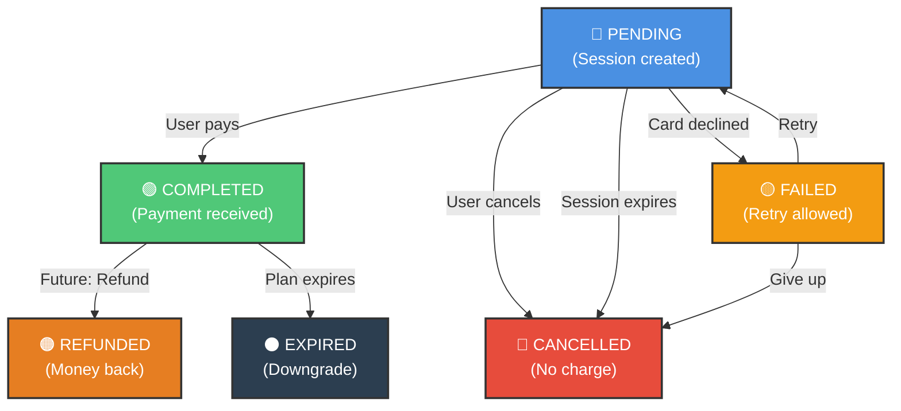

# Payment Flow Diagram

## Complete Payment Flow

```
┌─────────────────────────────────────────────────────────────────────┐
│                         PAYMENT FLOW - TALENTAI                      │
└─────────────────────────────────────────────────────────────────────┘

STEP 1: CREATE CHECKOUT SESSION
════════════════════════════════════════════════════════════════════════
     
     Frontend                Backend              Stripe             Database
        │                      │                    │                   │
        │ POST /stripe/        │                    │                   │
        │ create-checkout      │                    │                   │
        ├──────────────────────>                    │                   │
        │                      │ Validate Plan      │                   │
        │                      │                    │                   │
        │                      ├─ Get from DB      │                   │
        │                      │                    │                   │
        │                      │ Create Session    │                   │
        │                      ├──────────────────>│                   │
        │                      │                    │                   │
        │                      │<─── session ──────┤                   │
        │                      │                    │                   │
        │                      │ CREATE Payment     │                   │
        │                      ├─────────────────────────────────────>  │
        │                      │  (status: pending) │                   │
        │                      │                    │               INSERT│
        │                      │                    │                   │
        │<─ { sessionId,       │                    │<─ paymentId ───────┤
        │    url, paymentId }  │                    │                   │
        │                      │                    │                   │

STEP 2: USER COMPLETES STRIPE CHECKOUT
════════════════════════════════════════════════════════════════════════

     Frontend                 Stripe              User
        │                       │                   │
        ├─ Redirect to url─────>│                   │
        │                       │                   │
        │                       │ Payment Form      │
        │                       ├──────────────────>│
        │                       │                   │
        │                       │<─ Card Details ───┤
        │                       │                   │
        │                       │ Process           │
        │                       │ Payment           │
        │                       │ (external)        │
        │                       │                   │
        │                       │ Redirect to       │
        │<─────────────────────────────────────────┤
        │  success_url?status=success&session_id=cs_...
        │

STEP 3: VERIFY PAYMENT & UPDATE STATUS
════════════════════════════════════════════════════════════════════════

     Frontend                Backend              Stripe             Database
        │                      │                    │                   │
        │ POST /payments/      │                    │                   │
        │ verify               │                    │                   │
        ├─ { sessionId }      │                    │                   │
        ├──────────────────────>                    │                   │
        │                      │                    │                   │
        │                      │ Retrieve from DB   │                   │
        │                      ├─────────────────────────────────────>  │
        │                      │                    │<─ find payment ────┤
        │                      │                    │   (status: pending)│
        │                      │<───────────────────────── payment ──────┤
        │                      │                    │                   │
        │                      │ Verify with Stripe│                   │
        │                      ├──────────────────>│                   │
        │                      │                    │                   │
        │                      │<─ { payment_status: "paid", ... }────┤
        │                      │                    │                   │
        │                      │ UPDATE Payment     │                   │
        │                      ├─────────────────────────────────────>  │
        │                      │ status: "completed"│               UPDATE│
        │                      │ completedAt: now   │                   │
        │                      │ paymentIntentId: pi_...               │
        │                      │                    │<─────── ok ───────┤
        │                      │                    │                   │
        │<─ { success: true,   │                    │                   │
        │    data: payment }   │                    │                   │
        │                      │                    │                   │

STEP 4: ASSIGN PLAN TO COMPANY (CUSTOM LOGIC)
════════════════════════════════════════════════════════════════════════

     Backend                Database            Notification
        │                      │                    │
        │ Trigger Plan         │                    │
        │ Assignment           │                    │
        │                      │                    │
        ├─ GET Plan Details   │                    │
        ├─────────────────────>│                    │
        │                      │                    │
        │<─ { postsLimit,      │                    │
        │    monthlyInterview, │                    │
        │    ... }             │                    │
        │                      │                    │
        ├─ UPDATE Company     │                    │
        │ with Plan Details   │                    │
        ├─────────────────────>│                    │
        │                      │                    │
        │                      │ UPD CompanyPlan    │
        │                      │ UPD Counters       │
        │                      │ UPD Limits         │
        │                      │                    │
        │<─────── ok ──────────┤                    │
        │                      │                    │
        ├─ SEND NOTIFICATION  │                    │
        │ (Email/Push)         ├───────────────────>│
        │                      │                    │ User receives
        │                      │                    │ success message
        │                      │                    │

════════════════════════════════════════════════════════════════════════

DATA MODELS INVOLVED
════════════════════════════════════════════════════════════════════════

Payment {
  _id: ObjectId
  userId: ObjectId → User
  companyProfileId: ObjectId → Profile
  planId: ObjectId → PlanLimits
  planName: String
  planPrice: Number
  stripeSessionId: String (UNIQUE)
  stripePaymentIntentId: String
  status: "pending" | "completed" | "failed" | "cancelled"
  amountCents: Number
  currency: String
  completedAt: Date
  metadata: {
    postsLimit, 
    monthlyInterviewLimit,
    planDescription
  }
  createdAt: Date
  updatedAt: Date
}

PlanLimits {
  _id: ObjectId
  name: String
  priceUsd: Number
  postsLimit: Number
  monthlyInterviewLimit: Number
  description: String
  isActive: Boolean
}

════════════════════════════════════════════════════════════════════════

PAYMENT STATUSES & TRANSITIONS
════════════════════════════════════════════════════════════════════════

┌─────────────┐
│   PENDING   │ ← Initial state after session creation
└──────┬──────┘
       │
       ├─ User completes payment ──> ┌───────────────┐
       │                              │  COMPLETED    │ ✓
       │                              └───────────────┘
       │
       ├─ User cancels ────────────────┐
       │                               │
       └─ Session expires ─────────────┼──> ┌───────────────┐
                                       │    │  CANCELLED    │
                                       └───>└───────────────┘
                                             
Payment error ────────────────────────────> ┌───────────────┐
                                             │    FAILED     │
                                             └───────────────┘

════════════════════════════════════════════════════════════════════════

DATABASE QUERIES (WITH INDICES)
════════════════════════════════════════════════════════════════════════

// Index: { userId: 1, status: 1 }
Get user's completed payments: ~10ms
db.payments.find({ userId: ..., status: "completed" })

// Index: { companyProfileId: 1 }
Get company's payments: ~5ms
db.payments.find({ companyProfileId: ... })

// Index: { stripeSessionId: 1 } (UNIQUE)
Lookup by Stripe session: ~2ms
db.payments.findOne({ stripeSessionId: ... })

// Index: { createdAt: -1 }
Recent payments: ~3ms
db.payments.find().sort({ createdAt: -1 }).limit(10)

════════════════════════════════════════════════════════════════════════

ERROR HANDLING
════════════════════════════════════════════════════════════════════════

CREATE CHECKOUT SESSION
  └─> Invalid Plan ID
  └─> User not authenticated
  └─> User is not a Company
  └─> Free plan (no payment needed)
  └─> Missing BASE_URL

VERIFY PAYMENT
  └─> Session not found in Stripe
  └─> Payment not found in DB
  └─> Invalid status transition

UPDATE STATUS
  └─> Invalid payment ID
  └─> Invalid status value

════════════════════════════════════════════════════════════════════════
```

## Sequential Timeline

```
[10:00] User clicks "Upgrade to Premium"
   ↓
[10:01] POST /api/stripe/create-checkout-session
   ├─ Validate plan exists & is not free
   ├─ Create Stripe session
   ├─ Create Payment record (status: pending) ← DATABASE
   └─ Return sessionId, paymentId

[10:02] User redirected to Stripe Checkout
   ├─ Enters card details
   └─ Clicks "Pay"

[10:05] Stripe processes payment
   ├─ Validates card
   ├─ Charges customer
   └─ Marks session as paid

[10:06] Stripe redirects to success_url
   ├─ Frontend receives session_id
   └─ Shows "Verifying payment..."

[10:07] Frontend calls POST /api/payments/verify
   ├─ Backend retrieves Stripe session
   ├─ Confirms payment_status = "paid"
   ├─ UPDATE Payment (status: completed) ← DATABASE
   └─ Return success

[10:08] Backend triggers plan assignment
   ├─ UPDATE Company with new limits
   ├─ Reset monthly counters
   └─ Send success email

[10:10] User sees "Payment successful!"
   └─ New plan limits are active

```

## Status Diagram (Mermaid Format)


